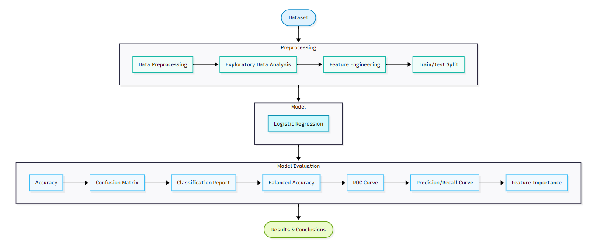
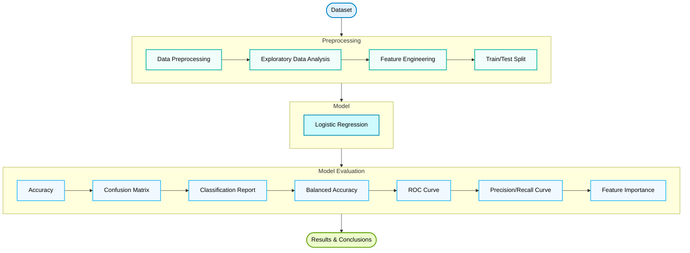
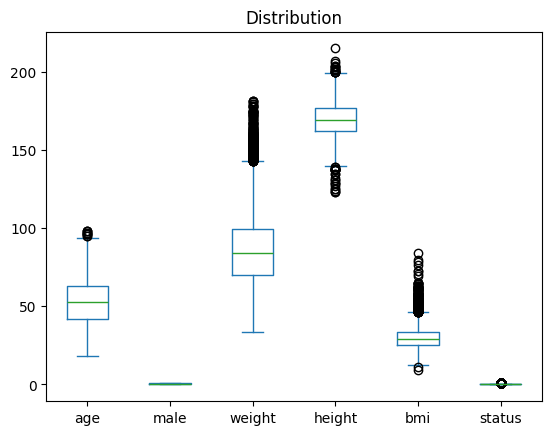
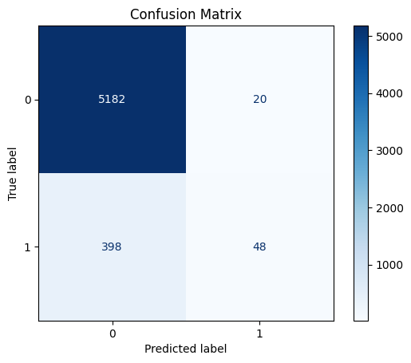
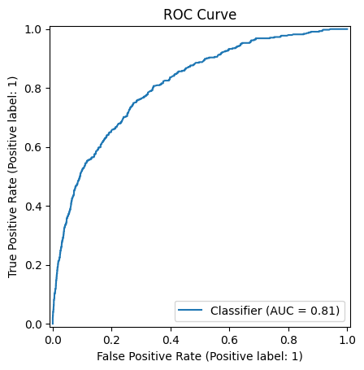
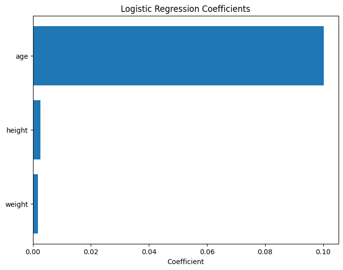

# NAFLD Mortality Prediction using Logistic Regression


> Machine Learning classification project that predicts patient survival outcomes using clinical data from individuals diagnosed with Non-Alcoholic Fatty Liver Disease (NAFLD).

<p align="center">

</p>
---

## Overview

This project applies a **Logistic Regression** classifier to predict patient life status using clinical information from individuals diagnosed with **Non-Alcoholic Fatty Liver Disease (NAFLD)**.

The notebook demonstrates the complete machine learning workflow, including:

- Data preprocessing
- Exploratory Data Analysis (EDA)
- Feature Engineering
- Logistic Regression
- Model Evaluation
- Interpretation of Results

Beyond model development, the project emphasizes the importance of selecting appropriate evaluation metrics when working with **imbalanced medical datasets**.

---

## Project Workflow



---

## Dataset


This project uses the **Non-Alcoholic Fatty Liver Disease (NAFLD)** dataset available on Kaggle. Please refer to the Kaggle dataset page for additional information regarding the data collection and licensing.

- **Source:** https://www.kaggle.com/datasets/utkarshx27/non-alcohol-fatty-liver-disease
- **File:** `nafld1.csv`
- **Size:** Approximately 897 KB

Dataset includes demographic and clinical measurements collected from patients diagnosed with NAFLD.
Target variable:
- Life Status
    - Alive
    - Deceased

The original dataset is included in the repository for reproducibility.
<p align="center">

</p>

---

## Features

- Missing value handling
- Feature engineering
- Data normalization
- Exploratory data analysis
- Logistic Regression classifier
- Confusion Matrix
- Classification Report
- Balanced Accuracy
- ROC Curve
- Precision–Recall Curve
- Feature Importance visualization

<p align="center">
  
  
  
</p>

---

## Repository Structure

```
nafld-mortality-prediction/
│
├── data/
│   └── nafld1.csv
│
├── images/
│
├── report
│   └── nafld_analysis
│
├── nafld_analysis.ipynb
├── requirements.txt
├── README.md
└── LICENSE
```

---

## Installation

```bash
git clone https://github.com/mayramtv/nafld-logistic-prediction.git

cd nafld-logistic-prediction

python -m venv .venv

source .venv/bin/activate

# Windows
.venv\Scripts\activate

pip install -r requirements.txt
```

---

## Results

The Logistic Regression model achieved an overall accuracy of approximately **92%**.

However, because the dataset is highly imbalanced, additional evaluation metrics were used to provide a more comprehensive assessment of model performance.

The analysis showed that while the model correctly classified most surviving patients, it struggled to identify the minority (deceased) class, demonstrating why accuracy alone is not sufficient for evaluating imbalanced classification problems.

---

## Key Takeaways

This project provided practical experience with the complete supervised machine learning workflow while highlighting several important concepts:

- Data preprocessing significantly affects model performance.
- High accuracy (92.6%) was largely driven by class imbalance.
- Accuracy alone can be misleading.
- Recall for deceased patients remained low (10.8%), highlighting the importance of evaluating multiple metrics.
- Confusion matrices and additional evaluation metrics provide a more complete understanding of classifier performance.
- Interpreting model limitations is as important as reporting model accuracy.

---

## Future Improvements

Possible extensions include:

- Class balancing techniques (SMOTE, class weighting)
- Hyperparameter optimization
- Cross-validation
- Comparison with Decision Trees, Random Forests, and Gradient Boosting
- Feature selection methods
- Model explainability using SHAP values

---

## Technologies

- Python
- Pandas
- NumPy
- Matplotlib
- Seaborn
- Scikit-Learn
- Jupyter Notebook

---

## References

Dataset:

https://www.kaggle.com/datasets/utkarshx27/non-alcohol-fatty-liver-disease

---

## Portfolio Update (2026)

This repository was originally completed as part of my undergraduate coursework and later revisited to improve the documentation, reproducibility, and interpretation of the results. The machine learning workflow remains unchanged, while the repository has been reorganized to follow modern GitHub best practices.

---

## License

This project is available under the MIT License.